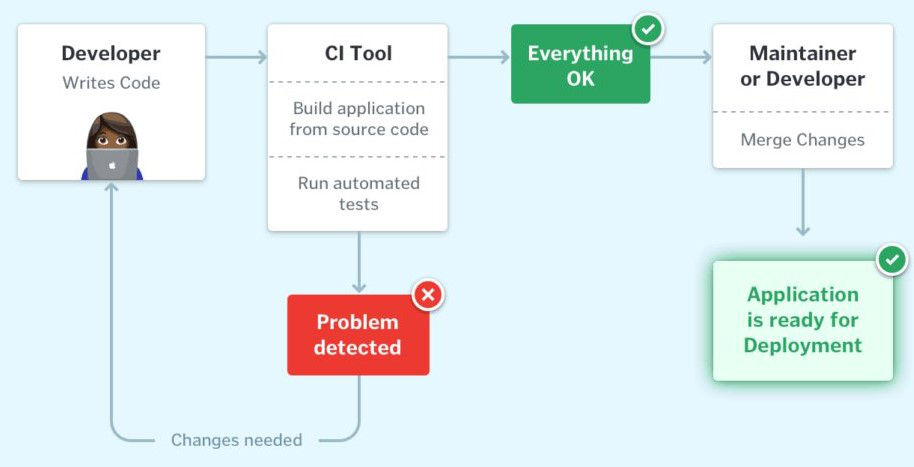

### ✅ CI/CD란?

  
CI/CD란 `CI(Continuous Integration) 지속적 통합`, `CD(Continuous Delivery/Deployment) 지속적 제공/배포`를 이야기합니다.

CI/CD는 여러 개발자들의 코드 변경을 하나의 코드베이스로 통합하는 작업입니다.

이를 통해 코드 변경 사항을 빠르고 안정적으로 배포할 수 있으며, 이를 통해 팀의 생산성을 높일 수 있습니다.

---

### ✅ CI (Continuous Integration)

#### 🔥 CI란?

`CI(Continuous Integration) 지속적 통합`은 코드 변경 사항을 자주, 지속적으로 공유 repository에 병합하는 프로세스를 이야기합니다.

병합 과정에서 자동화 된 테스트(unit/integration)를 통해 병합된 코드가 안정적임을 보장하는, 즉 신뢰성있는 코드를 유지할 수 있습니다.

어플리케이션을 개발하다보면, 여러 개발자들이 팀을 이뤄서 동시에 개발하는 경우가 흔합니다.

만일 개발자들이 각자 독립된 공간에서 따로 작업하다가 코드를 한 번에 병합하게 되면, 병합 과정에서 충돌도 많이 가게 되고 손이 많이 가는 시간이 많이 소요되는 작업이 될 것입니다.

개발자들 간의 IDE 환경이 모두 다르다면? 코드 컨벤션(code convention)이 합의가 되지 않았다면? 개발하는 영역이 겹친다면?

오... 생각만해도 병합할 때 재앙이 일어날 것 같습니다.

`CI`를 적용함으로서 개발 시, 여러 개의 브랜치에서 여러 개발자가 동시에 개발 중일 때 발생할 수 있는 문제들을 해결할 수 있습니다.

**성공적인 CI**는 개발자가 변경한 코드를 병합했을 때, 1️⃣ 어플리케이션을 자동으로 빌드하고, 2️⃣ 단위/통합 테스트와 같이 여러 수준의 자동화 된 테스트 실행을 통해 문제가 발생하지 않았는지 확인함으로서, 3️⃣ 병합된 코드가 안정적임을 보장합니다.

개발자가 변경한 코드를 특정 브랜치에 commit/merge 했을 때, `CI pipeline`가 실행되며, 빌드와 자동화 된 테스트 과정이 실행됩니다.

이에 대해 조금 더 알아보도록 하겠습니다.

#### 🔥 CI pipeline

`CI pipeline`을 그림으로 나타낸 것입니다. 

개발자가 변경 사항을 Git과 같은 VCS(version control system)에 commit하면, `CI pipeline`이 트리거되어 CI Tool을 통해 변경 사항에 대해 자동화 된 빌드 및 테스트를 진행합니다.

빌드와 테스트 과정에서 **문제가 발생한 경우**, 개발자에게 문제가 발생했으며 변경이 필요함을 알립니다.

문제가 발생하지 않은 경우, 변경 사항이 기존 코드베이스에 정상적으로 병합되어 배포 준비가 되었음을 알립니다.

이를 통해 버그를 더 빨리 찾아 해결할 수 있으며, 개발자가 수작업으로 병합 처리를 할 필요가 없어서 팀의 생산성을 높이고, 업데이트를 더 자주 제공할 수 있게 됩니다.

---

### ✅ CD (Continuous Delivery & Continuous Deployment)

#### 🔥 CI/CD에서의 CD란?

CI/CD에서의 CD는 continuous delivery 또는 continuous deployment를 이야기하며, 두 개념이 비슷해 가끔 혼용되기도 합니다. 두 개념 모두 파이프라인의 뒷 단계를 자동화하는 것이 목적이지만, 자동화가 어떻게 일어나는지 설명하기 위해 따로 이야기하기도 합니다.

개발팀, 운영팀의 구체적인 요구사항과 운영 방식에 따라 `continuous delivery`와 `continuous deployment` 중, 하나를 선택합니다.

#### 🔥 Continuous Delivery

`Continuous Delivery`는 `CI` 이후에 실행되며, CI에서 자동화 된 빌드와 단위/통합 테스트를 통과한 코드를 테스트 환경 or 프로덕션 환경에 배포함으로서,

표준화 된 테스트 단계를 통과해 실시간 프로덕션 환경에 배포할 수 있는 아티팩트(artifact)를 유지할 수 있습니다.

필수는 아니지만 프로덕션 환경에 배포하기 이전에 스테이징(staging) 환경 - 프로덕션과 유사한 환경 -에 우선 배포하여 테스트를 진행할 수 있고, 이를 통해 프로덕션에 배포했을 때 문제가 발생하지 않도록 합니다.

자동화 된 테스트 외에도 자동화 된 배포 프로세스를 갖추고 있기 때문에 배포 버튼을 클릭하기만 하면 언제든지 어플리케이션을 배포할 수 있습니다.

여기에서 중요한 점은 배포 프로세스가 자동화 되어 있지만, 프로덕션으로의 배포는 **수동 승인이 필요**하다는 점입니다.

`Continuous Delivery`는 어플리케이션이 언제든지 프로덕션(production) 환경에 배포될 수 있는 상태를 유지하는 것을 목표로 하며, 이를 통해 새로운 코드를 배포할 때 필요한 작업 및 노력을 최소화할 수 있습니다.

#### 🔥 Continuous Deployment

`Continuous Deployment`는 continuous delivery를 확장한 개념으로 **어플리케이션을 프로덕션 환경에 자동으로 배포하는 과정까지 포함**합니다.

프로덕션 배포 이전에 수동 승인 과정이 필요했던 continuous delivery와 달리, 수동 승인 과정이 없기 때문에 자동화가 얼마나 잘 설계되었느냐가 중요합니다.

(병합 -> 배포까지 사람의 개입이 전혀 없으며, 빌드/테스트 실패했을 경우에만 프로덕션 환경으로의 배포를 막습니다.)

실제 운영에서의 `continuous deployment`가 의미하는 바는, 자동화 된 테스트를 모두 통과한 코드를 병합했을 때 몇 분 내에 실시간 프로덕션 환경에 반영될 수 있다는 뜻입니다.

프로덕션 환경에 바로 반영되기 때문에 테스트 자동화 단계에서 다양한 단계의 테스트와 많은 고려가 필요합니다.

#### 🔥 Continuous Delivery vs Continuous Deployment

`Continuous delivery`와 `Continuous Deployment`는 변경된 코드의 commit부터 프로덕션 환경으로의 배포까지의 과정을 자동화한다는 공통점이 있습니다.

그럼 두 방식의 차이점은 무엇일까요?

위의 그림에서 알 수 있듯이, **프로덕션 환경으로의 배포 이전에 수동 승인 과정이 있느냐 없느냐**에 따라 구분할 수 있습니다.

Continuous delivery의 경우 개발팀 리더 또는 프로젝트 리더가 프로덕션 환경으로 배포 여부를 결정하며, 

Continuous deployment의 경우 수동 승인 과정 없이 프로덕션 환경으로의 배포가 자동으로 일어납니다.

---

### ✅  참고 자료 & 링크

- [What is CI/CD? - GeeksforGeeks](https://www.geeksforgeeks.org/what-is-ci-cd/)

- [CI/CD(CI CD, 지속적 통합/지속적 배포): 개념, 툴, 구축, 차이 - RedHat](https://www.redhat.com/ko/topics/devops/what-is-ci-cd)

- [CI/CD: The what, why, and how - GitHub](https://github.com/resources/articles/devops/ci-cd)

- [What is continuous delivery? - Amazon Web Services](https://aws.amazon.com/ko/devops/continuous-delivery/)